<!-- ───────────────────────────────────────────────────────────────
       LingyiChen-AI · profile README · cyberpunk neon edition
       hero / footer / hr SVGs live under ./assets
─────────────────────────────────────────────────────────────── -->

<div align="center">



<a href="https://github.com/LingyiChen-AI">
  
</a>

<p>
  <a href="https://github.com/LingyiChen-AI?tab=followers"></a>
  <!-- TOTAL_STARS_BADGE_START --><!-- TOTAL_STARS_BADGE_END -->
  
  
</p>

</div>

<br/>

### `▸ ABOUT.ME` <sub>` // who am i `</sub>

```ts
const chenhao = {
  role:     "AI Full-Stack Engineer",
  location: "Chengdu, China 🇨🇳",
  stack:    ["TypeScript", "Python", "Next.js", "Node", "LangGraph", "MCP"],
  loves:    ["Vibe Coding", "Agent Architecture", "Developer Tools", "Open Source"],
  building: "AI-native products that turn intent → shipped software",
  motto:    "Code less, vibe more. Let agents do the boilerplate.",
};
```

> **`▹`** 🧠 **Vibe Coding 深度实践者** — 从零用 Claude Code 搭建完整产品，代表作 [`vibe-coding`](https://github.com/LingyiChen-AI/vibe-coding)
> **`▹`** 🤖 **AI 应用 / Agent 架构** — 专注 LLM × 工作流 × Skill System × MCP
> **`▹`** 🧰 **全栈工程** — Next.js / Node / Python / K8s，端到端交付
> **`▹`** 🌱 <!-- STATS_LINE_START -->开源 **54** 仓库，累计 **5.6k+** stars<!-- STATS_LINE_END -->，代表作均已 Docker 一键部署

<br/>

### `▸ TOP_PROJECTS.LIVE` &nbsp; <sub>`★ sorted by live stars · auto-refresh / 6h`</sub>

<!-- TOP_PROJECTS_START -->
<table>
<tr>
<td width="50%" align="center">
  <a href="https://github.com/LingyiChen-AI/JadeAI">
    
  </a>
  <p>🎯 <b>JadeAI</b> · AI 智能简历生成器 · 50+ 模板 · PDF 解析 · JD 匹配<br/>
  
  
  
  </p>
</td>
<td width="50%" align="center">
  <a href="https://github.com/LingyiChen-AI/AIComicBuilder">
    
  </a>
  <p>🎬 <b>AIComicBuilder</b> · 剧本 → 角色 → 分镜 → 视频全自动<br/>
  
  
  
  </p>
</td>
</tr>
<tr>
<td width="50%" align="center">
  <a href="https://github.com/LingyiChen-AI/DeepDiagram">
    
  </a>
  <p>🧠 <b>DeepDiagram</b> · 自然语言 → 思维导图 / Mermaid / ECharts<br/>
  
  
  
  </p>
</td>
<td width="50%" align="center">
  <a href="https://github.com/LingyiChen-AI/vibe-coding">
    
  </a>
  <p>✨ <b>vibe-coding</b> · Claude Code 从零开发 AI 产品完整记录<br/>
  
  
  
  </p>
</td>
</tr>
<tr>
<td width="50%" align="center">
  <a href="https://github.com/LingyiChen-AI/comfyui-workflow-skill">
    
  </a>
  <p>🎨 <b>comfyui-workflow-skill</b> · NL → ComfyUI · 34 模板 · 360+ 节点<br/>
  
  
  
  </p>
</td>
<td width="50%" align="center">
  <a href="https://github.com/LingyiChen-AI/boris-prompts">
    
  </a>
  <p>📝 <b>boris-prompts</b> · Claude Code 作者 Boris 的 prompt 方法论实践<br/>
  
  
  
  </p>
</td>
</tr>
<tr>
<td width="50%" align="center">
  <a href="https://github.com/LingyiChen-AI/Mako">
    
  </a>
  <p>😎 <b>Mako</b> · 在线表情包制作与分享 · 图片上传 / 文字 / 特效<br/>
  
  
  
  </p>
</td>
<td width="50%" align="center">
  <a href="https://github.com/LingyiChen-AI/workflow-skill">
    
  </a>
  <p>⚙️ <b>workflow-skill</b> · 一句话 → Coze / Dify / ComfyUI 工作流 DSL<br/>
  
  
  
  </p>
</td>
</tr>
<tr>
<td width="50%" align="center">
  <a href="https://github.com/LingyiChen-AI/OpenSkills">
    
  </a>
  <p>🧩 <b>OpenSkills</b> · 开源 Agent Skill 框架 · Progressive Disclosure<br/>
  
  
  
  </p>
</td>
<td width="50%" align="center">
  <a href="https://github.com/LingyiChen-AI/next-chat-skills">
    
  </a>
  <p>💬 <b>next-chat-skills</b> · Next.js AI 助手 · Skill 自主调用 · 黑盒执行<br/>
  
  
  
  </p>
</td>
</tr>
</table>
<!-- TOP_PROJECTS_END -->

<div align="center">

<sub>💡 想看全部仓库？访问 <a href="https://github.com/LingyiChen-AI?tab=repositories"><code>github.com/LingyiChen-AI?tab=repositories</code></a></sub>

</div>

<br/>

### `▸ STACK.LOADED` &nbsp; <sub>`// arsenal`</sub>

<div align="center">

<a href="https://skillicons.dev">
  
</a>

<br/><br/>


</div>

<br/>

### `▸ METRICS.LIVE` &nbsp; <sub>`// signal stream`</sub>

<div align="center">


<br/>


<br/>


<br/>


</div>

<br/>

### `▸ PHILOSOPHY` &nbsp; <sub>`// the why`</sub>

```
┌──────────────────────────────────────────────────────────────────┐
│                                                                  │
│   "Vibe first, ship fast. Let the agent handle the boring        │
│    parts — so humans can focus on taste, product, and the        │
│    next crazy idea."                                             │
│                                                                  │
│                                          — chenhao @ chengdu     │
└──────────────────────────────────────────────────────────────────┘
```

<br/>

### `▸ COMMUNITY.JOIN` &nbsp; <sub>`// connect`</sub>

<div align="center">

<table>
<tr>
<td align="center" width="50%">

<br/>

<b>📡 加入交流群</b>

<sub><i>欢迎扫码加入 · 一起聊聊 AI / Agent / Vibe Coding</i></sub>

<br/><br/>


<br/>

<sub><code>scan to join · feishu</code></sub>

</td>
<td align="center" width="50%">

<br/>

<b>🔗 一起搞点事情</b>

<br/><br/>

<a href="https://github.com/LingyiChen-AI"></a>

<br/>

<a href="https://github.com/LingyiChen-AI?tab=repositories"></a>

<br/>

<a href="https://github.com/LingyiChen-AI/vibe-coding"></a>

<br/><br/>

<sub><i>"Code less, vibe more."</i></sub>

</td>
</tr>
</table>

<br/>



</div>
